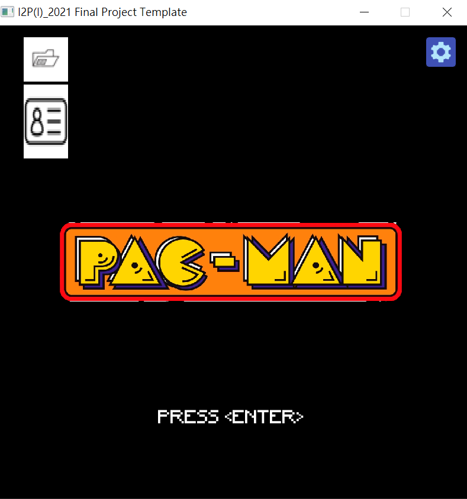
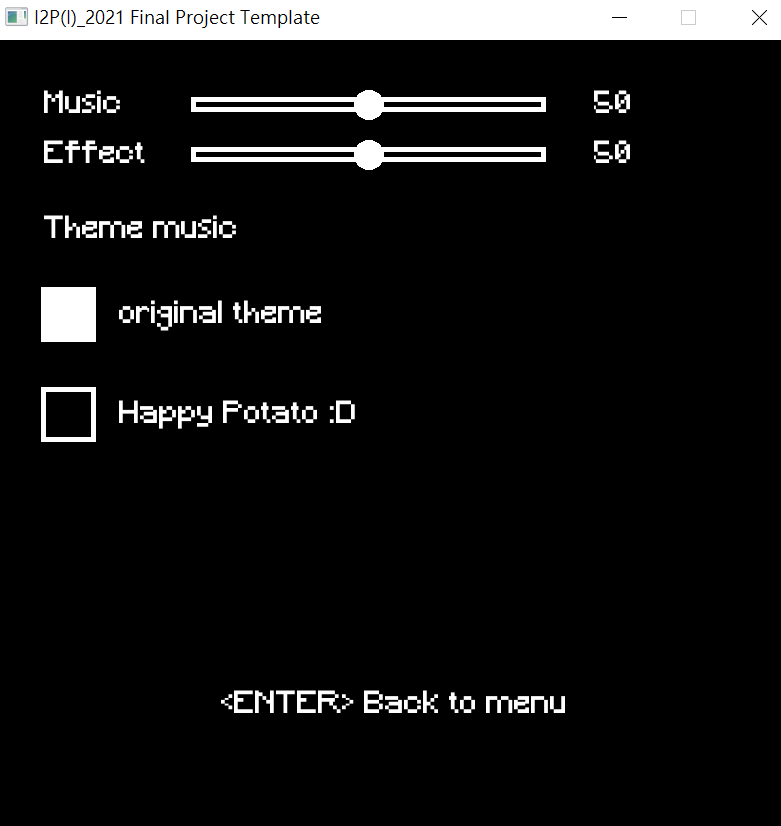
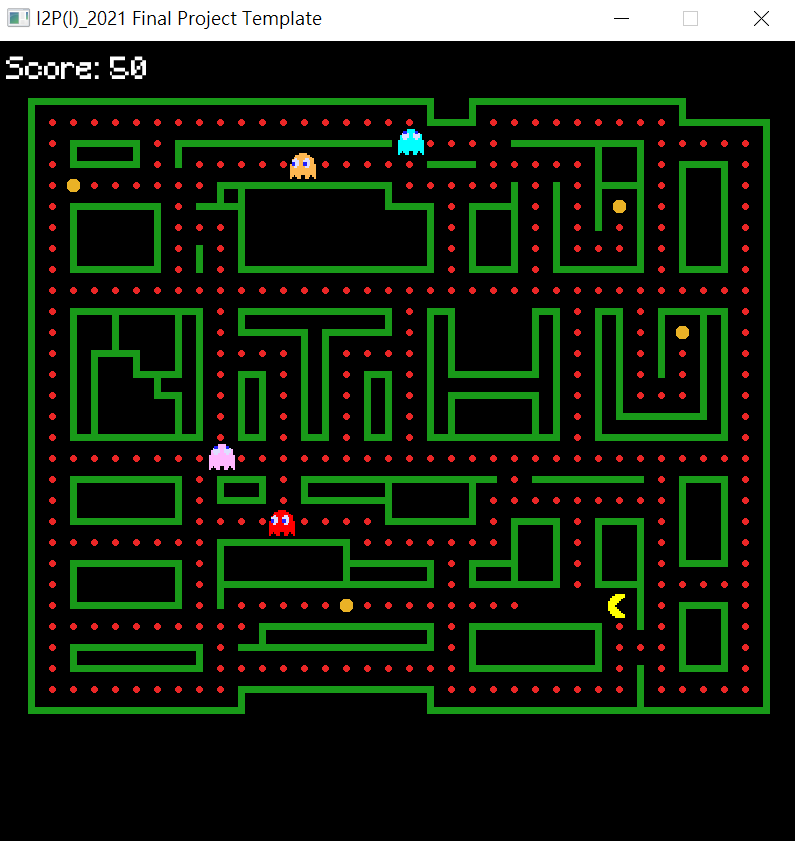
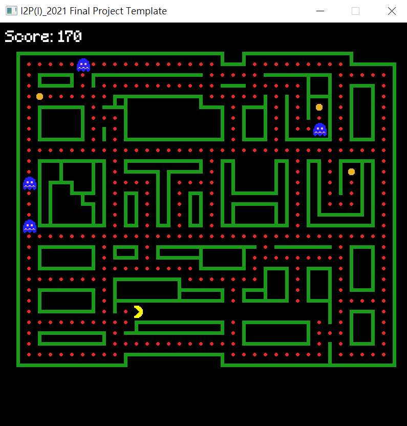
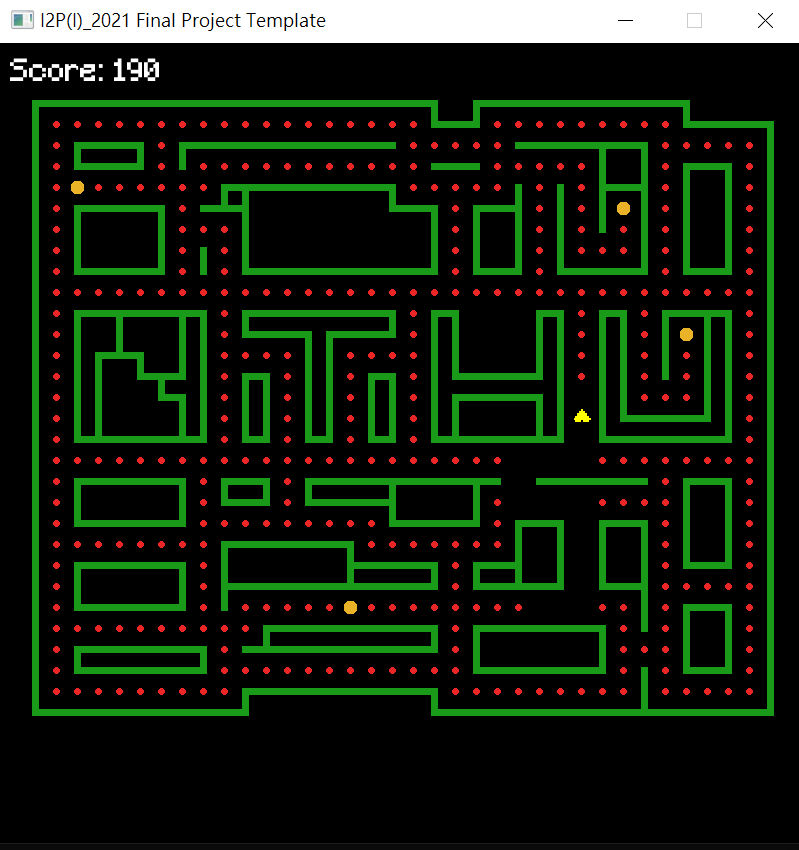

# I2P1_Pacman

A pacman game written by C.

## Main Scene

In the Main Scene, players can access the Setting Scene by clicking the icon in the upper-right corner of the screen or start the game by pressing `ENTER` on the keyboard.

  

## Setting Scene

In the Setting Scene, players can adjust the theme music and the volume of both sound effects and background music. The current volume level is displayed next to the sliding bar. While adjusting the volume, a sample sound effect will play to demonstrate the changes.

  

## Game Scene

The score is displayed in the upper-left corner of the screen. Eating a small bean awards **10 points**, and the score updates immediately. The game ends if Pacman touches a ghost (lose) or successfully eats all the beans on the screen (win).

  

### Power Bean Mode

Pacman could enter power bean mode by eating the big bean. Pacman can enter Power Bean Mode by eating a big bean. In this mode, Pacman can chase and temporarily defeat ghosts for bonus points. Power bean mode ends soon when the ghost start to flashing between dark blue and white.

  

### Cheat Mode

There is several key for cheat mode. Cheat Mode keys toggle-based, the player don't need to hold it for continuously activating it.

- `Ctrl + S` : ghosts stop moving
- `Ctrl + L` : allow pacman to cross the wall
- `K` : all ghosts go back to the room and reset their behaviours

### Algorithm of ghost

Ghosts primarily move randomly. However, if Pacman comes within 3 blocks of a ghost, the ghost will switch to an algorithm that finds the shortest path to Pacman's position.

## Lose Scene

If Pacman loses (comes into contact with a ghost), a dying animation is played before returning to the Main Scene.

  

## Winning Scene

If Pacman wins (eats all the beans), the game transitions back to the Main Scene immediately.

### More detailed demo

// the link
